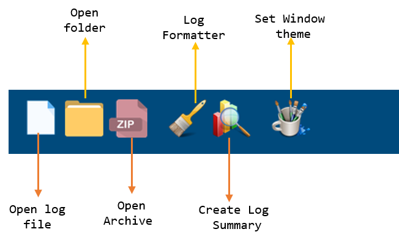
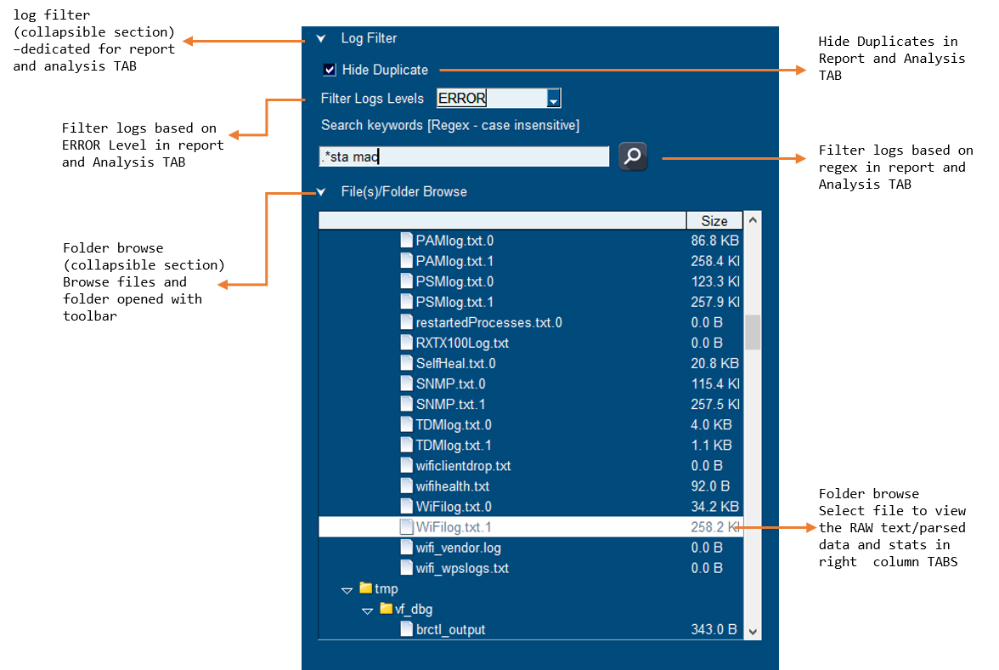
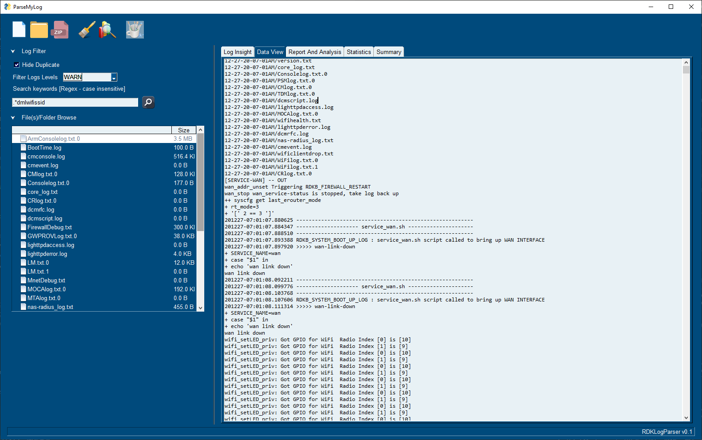
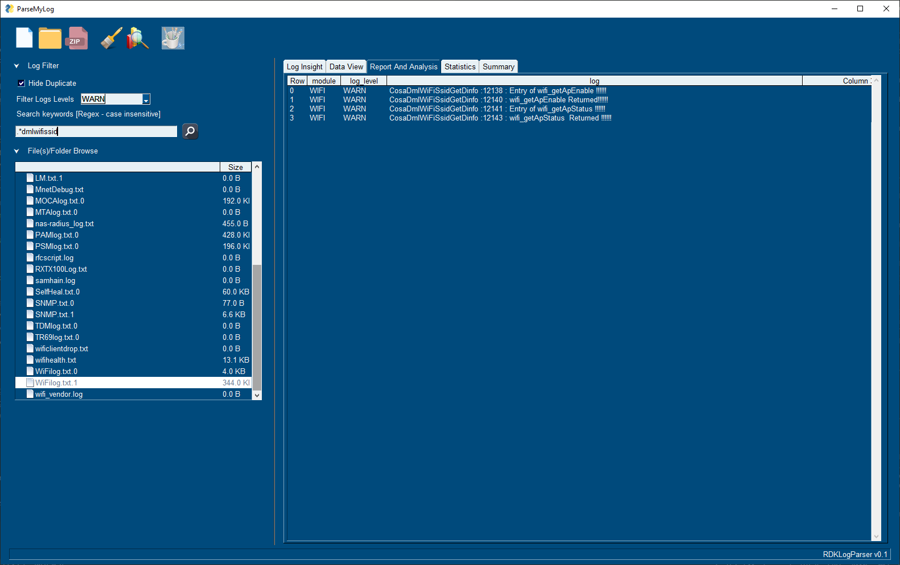
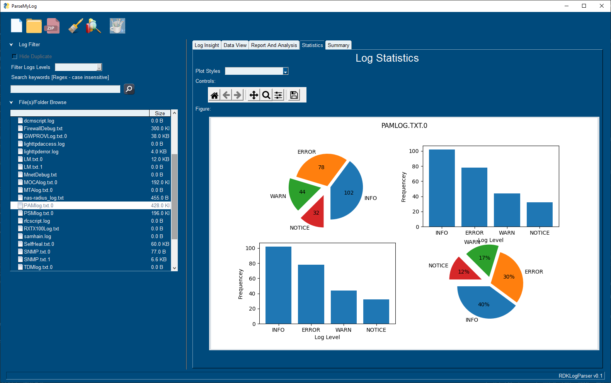
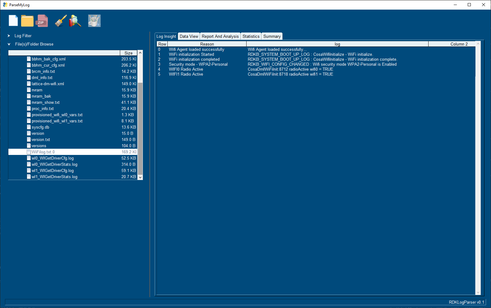
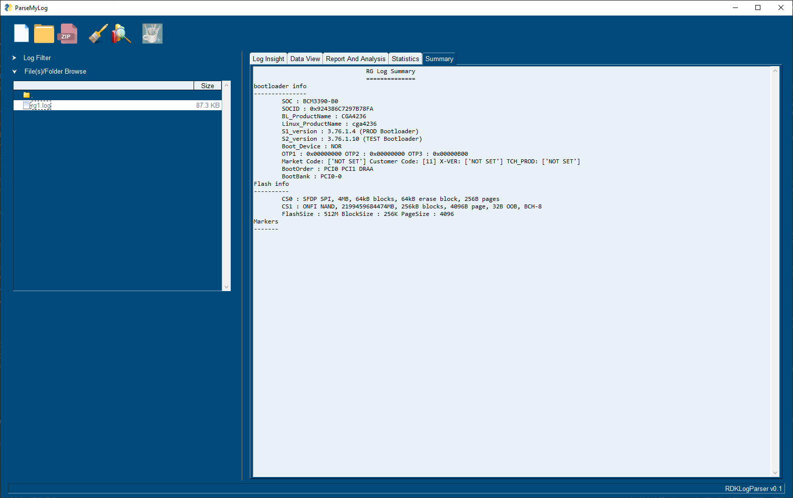

# ParseMyLog
A Simple GUI App to read RDK log files and display the insights to the developer.

# Table Of Contents
[[_TOC_]]

<p>

<summary><h2>User Guide</h2></summary>
  The envisioned Log parser is still in beta stage.

### Usage guide
  Currently `ParseMyLog` is available in Python [SDIST](https://docs.python.org/3/distutils/sourcedist.html) package

####  How to install
   1. Untar the `parsemylog-1.0.0.tar.gz` Relase tarball
   2. cd into the parsemylog folder and 
   3. execute `python setup.py install` - this will install required packages
   4. Start using the parsemylog by executing `parsemylog` in any terminal. Currently it is tested in `Windows` only.

<p>

<summary><h4>GUI Overview</h4></summary>

<p>

<summary><h5>ToolBar</h5></summary>

```
- The Left group open file, folder and archive formatted logs accordingly. 
- The log formatter icon is not assigned any function yet.
- The Log summary icons will create a `summary report` extracted from the log(s)
- The Window theme icon is used to change entire window theme from a list of themes. 
- Once a theme is set, it is persistent untill user set another theme.
```
:information_source: Window theme icon will be disabled once user opens logs.

 


</p>

<p>

<summary><h5>Left Section - Log Filter/Folder Browse</h5></summary>

```
The Log filter section is dedicated to Report and Analysis Tab to filter and search parsed logs
File(s)/Folder collabsible section gives the TREE view os he selected file(s)/Folder.
```
 


</p>

<p>

<summary><h5>NotePad TAB</h5></summary>

```
This is just like a notepad, used to view the RAW logs selected in the left files/folder section
```
 


</p>

<p>

<summary><h5>Report And Analysis TAB</h5></summary>

```
The opened log(s) are parsed based on the regex and filenames provided in the configs folder. 
The log formatter are in YAML format, this will let us know how each should be parsed in a particular log file. 
```
<a href="https://gitlab.lwr.am.thmulti.com/tch-tools/ParseMyLog/-/blob/master/parsemylog/configs/config.yaml#L57">Log Formatter</a> 
is in YAML format. Did you know official <a href="http://yaml.org/">YAML website</a> is also in YAML format?

 


</p>

<p>

<summary><h5>Statistics TAB</h5></summary>

```
This plots the parsed logs based on the ERROR level distribution
```
:information_source: Duplicate plots will be replaced in future with different plot.

 


</p>

<p>

<summary><h5>Log Insight TAB</h5></summary>

```
Report and Analysis tab is based on the Log format parsing. 
The log insight is fed with differet YAML format to extract key information from a particular log file
```
 


</p>

<p>

<summary><h5>Summary TAB</h5></summary>

```
The summary tab list out all the key informations of log insight 
```
 


</p>


</p>


</p>


<p>

<summary markdown="span"><h2>Developer Guide</h2></summary>

  ParseMyLog is based on [PysimpleGUI](https://pypi.org/project/PySimpleGUI/) GUI Framework. To start with check their vast [Demo Programs](https://github.com/PySimpleGUI/PySimpleGUI/tree/master/DemoPrograms) and [Documentations](https://pysimplegui.readthedocs.io/en/latest/).

#### Architecture Details

The code is organized as two different modules, core and gui. 

<b><a href="https://gitlab.lwr.am.thmulti.com/tch-tools/ParseMyLog/-/tree/master/parsemylog/core">CORE</a></b>  
This module has log format parser classes like logFormatParser, logInsightParser, rgLogParser and configs folder that contains the log format specifiers.  

_Python modules used in core_

1. Python Pandas  
   [Getting Started](https://pandas.pydata.org/pandas-docs/stable/getting_started/index.html#getting-started)  
   [API reference Guide](https://pandas.pydata.org/pandas-docs/stable/reference/index.html#api)  
   [User Guide](https://pandas.pydata.org/pandas-docs/stable/user_guide/index.html#user-guide)  

2. Python Regex  
   [Regex Tutorial](https://realpython.com/regex-python/)  
   [To validate the regex patterns](https://regex101.com/)  

3.  YAML  
   The regex's are given as input to logFormatParser in YAML format.  
   [Official YAML website](http://yaml.org/)  

4. importlib resource import  
  The resources like log configs are managed through python importlib resource module  
  Nice Tutorial about [Resource Import](https://realpython.com/python-import/#resource-imports)  

<b><a href="https://gitlab.lwr.am.thmulti.com/tch-tools/ParseMyLog/-/tree/master/parsemylog/gui">GUI</a></b>  
This module contains GUI layouts and event handlers. Entry point of the code is <a href="https://gitlab.lwr.am.thmulti.com/tch-tools/ParseMyLog/-/blob/master/parsemylog/parsemylog.py#L65">parsemylog.py</a>  
The icons folder contains the GUI icons in BASE64 format, this will avoid storing and maintaining the GUI elements in icon/png/jpg formats.  
eventHandler.py is the main part of the code. it contains dict formatted `event:func_to_handle` regestered handlers, For every user click an event will be generated, which is handled with the regestered handlers.  

__Logging for ParseMyLog__  
Python Logging module is used to log debug logs. There are N=2 log modes  
1. Dev  
   Enable Logging in both console and file (parsemylog.log). Log level enabled upto DEBUG logs.  

2. Prod  
   Enable Logging in file (parsemylog.log) only. Log level enabled upto DEBUG logs, in future this will be limited to upto ERROR logs.  
  
[logging_conf.yaml](https://gitlab.lwr.am.thmulti.com/tch-tools/ParseMyLog/-/blob/master/parsemylog/core/logging_conf.yaml)  
```yaml
loggers:
  Dev:
    level: DEBUG
    handlers: [console, file_handler]
    propagate: no
  Prod:
    level: DEBUG
    handlers: [file_handler]
    propagate: no
```

#### ParseMyLog Release    
```shell
python setup.py sdist
```
This wil create source distribution package under `dist` folder with version as current git TAG.  


#### known issues/Bugs
  1. Changing themes after loading the logs file/folder will clear the loaded info. This is fixed by disabling the window theme icon after loading logs folder.  
  2. 

#### Future Improvements   
  TODO   
  1. Add the below files in config.yaml
      lighttpdaccess.log
      lighttpderror.log
      SelfHeal.txt.0

  2. Find a way to display the below files to display in "Report and Analysis" tab.
     ArmCOnsole, MnetDebug.txt, FirewallDebug.txt, SelfHeal.txt

  3. Parsing RebootReasonlog

  4. Parsing oomstats.txt 

  5. Parsing dibbler logs

  6. Hide out snmp request type and snmp_param column for logs other than SNMP file.

  7. Add YAML file for below:
     1. PandM
     2. SelfHeal
     3. cmconsole
     4. BootTime
     5. SNMP
     6. WifiLog additional changes
     7. GWProvLog additional changes
     8. ArmConsolelog
     9. MTAlog
    10. rgconsole.log additional changes
    11. LM log  
    12. CRLog  
    13. Moca  
    14. PSMlog  
    15. TDMlog  
    16. TR69  
    17. MeshAgentLog  
    18. Hotspot  
    19. lighttpderror log  

</p>

